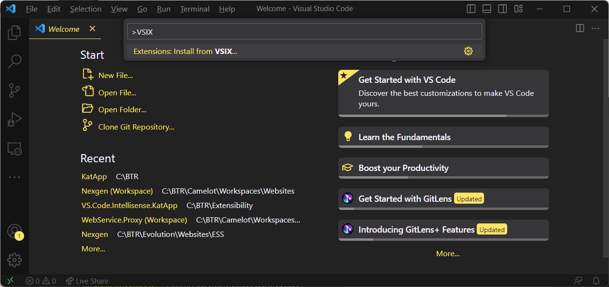
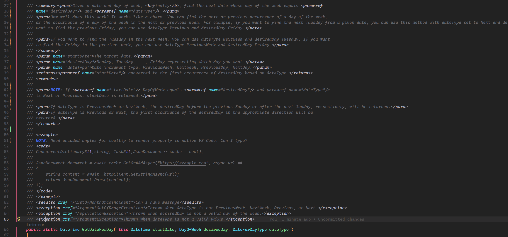
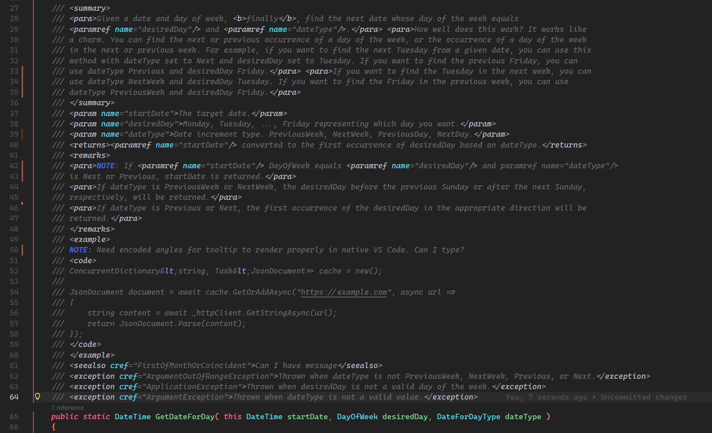
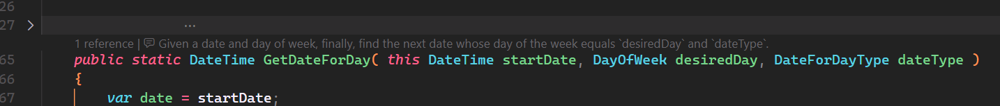
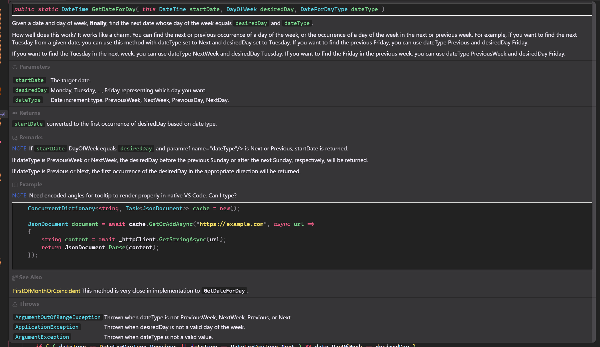
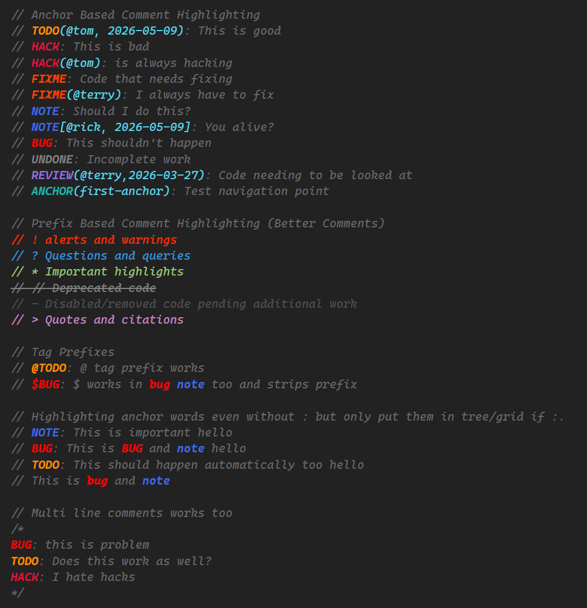
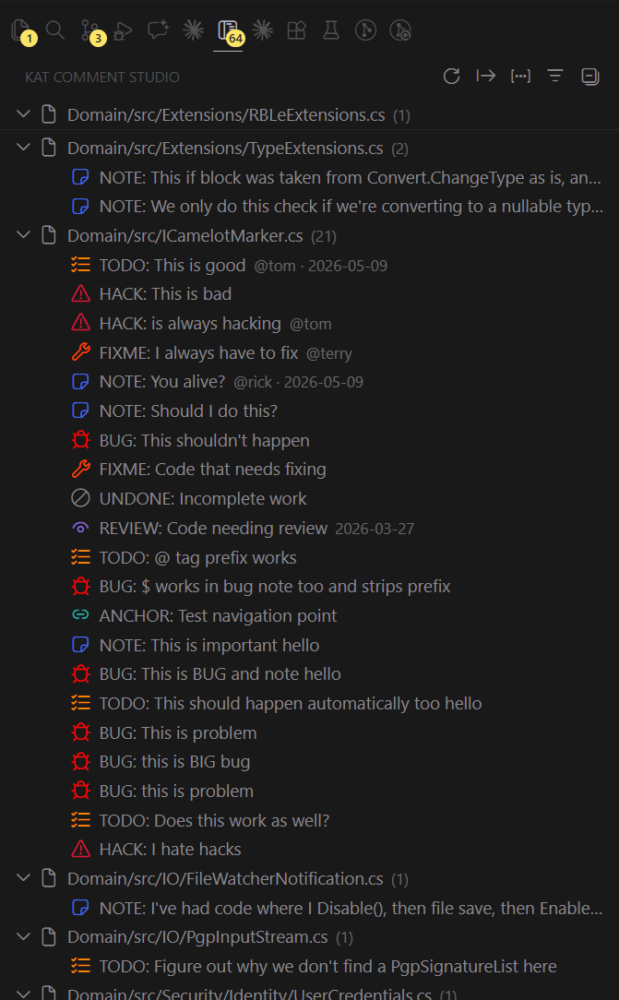
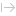
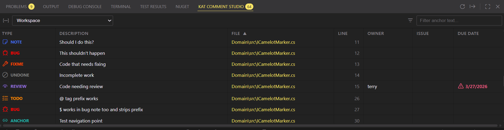
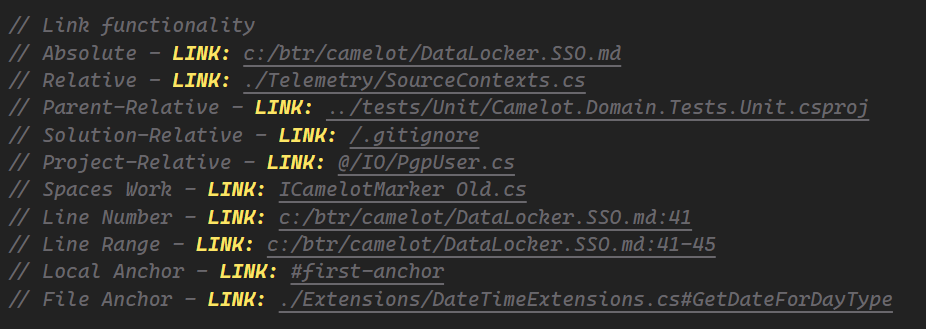

# KAT Comment Studio

**KAT Comment Studio** is a VS Code extension that brings rich XML documentation comment rendering, smart comment reflow, workspace-wide code anchors, clickable issue links, and `LINK:` navigation to your editor. It is a port and extension of [madskristensen/CommentsVS](https://github.com/madskristensen/CommentsVS) for Visual Studio Code.  You can see a presentation of this at [10 New Visual Studio Extensions from Mads](https://www.youtube.com/watch?v=5v1aB-bq3a8&t=471s) video on YouTube.

## Supported Languages

C#, VB, F#, C/C++, TypeScript, JavaScript, TypeScript/JavaScript React, Razor, SQL, PowerShell

## Getting Started

1. [Download the extension](https://github.com/terryaney/Extensibility.VS.Code.Comment.Studio/raw/main/dist/kat-comment-studio-1.0.5.vsix).
1. Press `Ctrl+Shift+P` to open the VS Code command palette. Type `VSIX` and select **Extensions: Install from VSIX...**.



3. Browse to the downloaded `kat-comment-studio-1.0.5.vsix` file and select it.
4. Open a `.cs` file with XML documentation comments, add some code anchors, and enjoy.

Install [previous versions](#previous-versions) of the extension if needed.

## Features

- [XML Doc Comment Rendering](#xml-doc-comment-rendering)
- [Prefix Highlighting](#prefix-highlighting-better-comments-style)
- [Comment Reflow](#comment-reflow)
- [Code Anchors](#code-anchors)
- [Issue Links](#issue-links)
- [LINK: Navigation](#link-navigation)
- [Comment Remover](#comment-remover)
- [Color Customization](#color-customization)
- [Settings Reference](#settings-reference)
- [Extension Developers](#extension-developers)

---

## XML Doc Comment Rendering

When rendering is **On**, XML documentation comment blocks are transformed from raw XML into a clean, readable experience using VS Code's native CodeLens API with automatic reflow, expansion, and folding.  By default, let's start with a sample XML comment block as shown in the image below and discussion some of the problems it addresses.

1. This is a large comment block that takes almost the entire screen and given different VS Code themes, it can be difficult to read.  Pair this with all, or many, of the methods with similar size comment blocks and it makes navigating and understanding the code challenging.
1. Line 27, has an odd break within the `paramref` element.
1. Line 30 has an extremely long line.
1. Lines 32, 41, and 49 have inconsistent blank lines that serve no real purpose.
1. The code example at line 52 isn't rendered as code at all.



### Comment Reflow

KAT Comment Studio automatically wraps and reformats XML doc comment blocks to stay within a configurable line width.

#### Commands and Code Actions

Comment reflow is available through:

- **Command Palette** ? `KAT Comment Studio: Reflow Current Comment` — reflow the comment block at the cursor position
- **Command Palette** ? `KAT Comment Studio: Reflow Comments in File` — reflow all comment blocks in the document
- **Right-click** ? **KAT Comment Studio** submenu — `Reflow Current Comment` (cursor in comment only) and `Reflow Comments in File`
- **Light Bulb / Code Action** (`Ctrl+.`) — when cursor is inside a comment block, offers "Reflow Current Comment" and "Reflow Comments in File"

The extension does not register a document or range formatting provider, avoiding conflicts with language-specific formatters (e.g., C# Dev Kit, OmniSharp).

#### Light Bulb (Code Action)

Place the cursor anywhere inside an XML doc comment block, then press `Ctrl+.` to see a **Reflow Current Comment** code action. This reflows only the current comment block without touching any other formatting.

#### Smart Paste

When you paste text into an XML doc comment block, the entire block is automatically reflowed to fit within the max line width.

Controlled by `kat-comment-studio.enableReflowOnPaste` (default: `true`).

#### Auto-Reflow on Edit Exit

When you exit a doc comment block after making edits, the block is automatically reflowed to fit within the max line width.

Controlled by `kat-comment-studio.enableReflowWhileTyping` (default: `true`).

#### Line Width

The reflow width is resolved in this order:
1. `.editorconfig` `max_line_length` for the file's directory (if present)
2. `kat-comment-studio.maxLineLength` setting (default: `120`)

#### XML-Aware Wrapping

The reflow engine understands XML structure:
- Block tags (`<summary>`, `<remarks>`, `<param>`, etc.) each wrap their content independently
- `<code>` blocks are preserved as preformatted — never reflowed

---

When rendering is **On**, the extension automatically performs a 'reflow' to improve readability by adjusting line breaks, indentation, and spacing within the XML comment block when exiting a comment block.  You can also trigger a manual reflow via the command palette or context menu.

1. XML elements are never split.  Notice how entire `paramref` element was moved down to line 29.
2. All comment lengths are adjusted to fit the width defined at `kat-comment-studio.maxLineLength` setting.
3. All unnecessary blank lines between XML elements are removed to improve readability.
4. `<summary>` is always forced to be on its own line to improve code lines discussed below.



---

### Rendering Behavior

The following is how XML comments are rendered after existing an XML comment block.

1. With `kat-comment-studio.dimOpacity: 0`, the entire XML comment is transparent.  But the collapse chevron in left gutter, the `...` decoration, and the single line height remain to enable expanding/entering the comment block when edits are required.  The comment auto-unfolds after 500ms delay on the block line, and auto-re-folds after ~500ms when the cursor leaves the block.
1. There is a CodeLens that renders the member summary.
	- If more than one `<para>` elements are present, it only renders the first one (or only the content before the first if comment is created in that form).
	- If the summary is long, it truncates at `kat-comment-studio.codeLensMaxLength`.  An empty setting or value of `0` disables truncation.
1. If you click on the CodeLens, it opens a [Documentation Popup](#documentation-popup) displaying the entire XML comment block formatted in an easy to read format.



### Documentation Popup

Click the **summary text** in a CodeLens to open a VS Code hover popup displaying the full XML comment block in a formatted, readable layout:

- **Summary** — rendered as styled text
- **Parameters** — listed with name and description
- **Returns** — inline with description
- **Remarks** — label on its own line, content indented below
- **Value** — property value description, rendered inline
- **Example** — rendered as a fenced code block
- **Exceptions** — list of exception types and descriptions
- **See Also** — clickable links
- **Anchor tags** — TODO:, NOTE:, HACK:, etc. are colorized using their configured colors

The popup uses VS Code theme variables for consistent styling and dismisses naturally when the cursor moves away — it is a standard VS Code hover, not a panel or overlay.

Inline formatting within XML tags is fully rendered: `code`, **bold**, *italic*, ~~strikethrough~~, and hyperlinks.

The `kat-comment-studio.codeLensMaxLength` setting controls how much of the summary is shown in the CodeLens text before truncation — the popup always shows the full content regardless.

Given the original (extreme) example of a long comment, when clicking the summary, you would see a popup like the following:



#### XML Tag Support

The following XML doc tags are rendered in the documentation popup:

`<summary>`, `<param>`, `<typeparam>`, `<returns>`, `<value>`, `<remarks>`, `<example>`, `<exception>`, `<see>`, `<seealso>`, `<inheritdoc>`, `<paramref>`, `<typeparamref>`, `<c>`, `<code>`, `<list>`

### Toggle Rendering

| Trigger | Action |
|---|---|
| Command Palette ? `Comment Studio: Toggle Comment Rendering` | Toggle rendering |
| Right-click ? **Comment Studio** submenu | Quick access |
| Status Bar ?  `OFF` and  `ON` Icons | Toggle rendering |

### Collapse by Default

Enable `kat-comment-studio.collapseByDefault` to automatically fold all XML doc comment blocks whenever a file is opened. This only applies when rendering is **Off** — when rendering is **On**, comments are always auto-folded as part of the rendering experience.

---

### Comment Remover

Two XML doc comment removal commands are available from the right-click **KAT Comment Studio** context menu and the Command Palette.

| Command | Description |
|---|---|
| `Remove Current XML Comment` | Removes the XML doc comment block at the cursor position. Only enabled when the cursor is inside an XML doc comment. |
| `Remove All XML Comments in File` | Removes every XML doc comment block in the active file. |

Both commands are accessible via the **KAT Comment Studio** right-click context menu. `Remove Current XML Comment` is only shown in the context menu when the cursor is inside an XML doc comment block.

---

## Code Anchors

Code anchors are specially tagged comments that mark items of interest across your workspace. KAT Comment Studio scans your entire workspace, displays anchors in a tree view and grid panel, and lets you navigate between them.



### Built-in Anchor Types

| Tag | Color | Icon | Purpose |
|---|---|---|---|
| `TODO` | `colors.todo` `#FF8C00` |  | Work to be done |
| `HACK` | `colors.hack` `#DC143C` |  | Workaround that needs cleanup |
| `NOTE` | `colors.note` `#4169E1` |  | Important information |
| `BUG` | `colors.bug` `#FF0000` |  | Known bug |
| `FIXME` | `colors.fixme` `#FF4500` |  | Must be fixed |
| `UNDONE` | `colors.undone` `#808080` |  | Reverted or incomplete |
| `REVIEW` | `colors.review` `#9370DB` |  | Needs review |
| `ANCHOR` | `colors.anchor` `#20B2AA` |  | Named navigation target |

### Basic Syntax

Tags are **case-insensitive** for detection — `todo`, `Todo`, and `TODO` are all recognized and displayed as their canonical uppercase form in all views. Colorization of tags not followed by `:` is controlled by the `kat-comment-studio.anchorColorizeMode` setting (default: `caseInsensitive`).

```
// TODO: Add input validation
// todo: also works — normalized to TODO
// HACK: Temporary workaround until v2
// BUG: Off-by-one in edge case
// FIXME: This crashes on null input
// NOTE: This method is called from multiple threads
// ANCHOR(MyAnchor): navigation target
```

### Rich Metadata

Metadata can be embedded directly after the tag in parentheses:

```
// TODO(@alice): Implement the export feature
// FIXME [#1234]: Known issue tracked in GitHub
// TODO(@bob, #456): Refactor this — assigned to bob, tracked in issue 456
// TODO(2026-06-01): Remove this workaround after migration
// TODO(@alice, #789, 2026-03-15): Assigned, tracked, and due-dated
```

| Metadata | Syntax | Description |
|---|---|---|
| Owner | `(@name)` | Person responsible |
| Issue reference | `[#123]` | Linked issue number |
| Due date | `(yyyy-MM-dd)` | ISO date shown in tree and grid |
| Anchor name | `ANCHOR(name)` | Named target for `LINK:` navigation |

> **Note:** `ANCHOR:` without a name (e.g., `// ANCHOR:`) is silently ignored — a name is required for the anchor to have any purpose as a navigation target.

### Prefix Highlighting (Better Comments Style)

Comments beginning with specific prefix characters are highlighted with distinct colors and styles, inspired by the popular [Better Comments](https://marketplace.visualstudio.com/items?itemName=aaron-bond.better-comments) approach.

| Prefix | Color setting | Default (dark / light) | Purpose |
|---|---|---|---|
| `// !` | `colors.prefixAlert` | `#FF2D00` / `#CC0000` | Alerts and warnings |
| `// ?` | `colors.prefixQuestion` | `#3498DB` / `#2070B0` | Questions |
| `// *` | `colors.prefixHighlight` | `#98C379` / `#008000` | Highlighted notes |
| `// //` | `colors.prefixStrikethrough` | `#808080` / `#999999` | Deprecated / disabled code comments (strikethrough) |
| `// -` | `colors.prefixDisabled` | `#505050` / `#AAAAAA` | Disabled items |
| `// >` | `colors.prefixQuote` | `#C586C0` / `#800080` | Quotes (italic) |

These patterns also work with `#` (PowerShell/Python), `'` (VB), and other single-line comment markers.

Disable with `kat-comment-studio.enablePrefixHighlighting: false`.

### Custom Tags

Add your own tags via `kat-comment-studio.customTags` (comma-separated). Custom tags are highlighted in **Goldenrod** and appear in all views alongside built-in types.

```json
"kat-comment-studio.customTags": "PERF, SECURITY, DEBT, REFACTOR"
```

### Tag Prefixes

Allow prefix characters before tags so `// @TODO:` is treated the same as `// TODO:`. Configure via `kat-comment-studio.tagPrefixes` (default: `@, $`).

### Inline Decorations

Each anchor tag is highlighted inline in the editor with its type color. Colored markers also appear in the **scrollbar/overview ruler** so you can see anchor density at a glance.

Disable with `kat-comment-studio.enableTagHighlighting: false`.

### Sidebar Tree View

The **KAT Comment Studio** activity bar panel shows a tree of all anchors grouped by file.



**Toolbar actions:**

| Button | Action |
|---|---|
|  Scan | Scan the entire workspace for anchors |
|  Export | Export visible anchors to a file |
|  Set Scope | Filter by scope |
|  Filter Types | Toggle which anchor types are shown |

**Scope options** (Command Palette ? `Comment Studio: Set Anchor Scope` or the grid dropdown):

- **Workspace** — all files in the workspace
- **Current Folder** — the active file's workspace folder. In a single-folder window this is the root folder; in a multi-root workspace it is disabled until an active workspace document exists.
- **Current Document** — only the active file
- **Open Documents** — all currently open files
- **Repo: _name_** — only files inside a discovered Git repository
- **Project: _name_** — only files inside a discovered `.csproj`

**Type filter** (Command Palette ? `Comment Studio: Filter Anchor Types`):
Multi-select picker to show/hide specific anchor types. The tree view and bottom grid now share the same scope, search text, and type filter state so refreshes and rescans do not reset the active view.

### Bottom Panel Grid

A sortable, filterable grid panel (**KAT Comment Studio - Code Anchors**) is available in the bottom panel alongside Problems and Output.



**Columns:** Type · Description · File · Line · Owner · Issue · Due Date

- Click a column header to sort ascending/descending
- Free-text search filters across description, file, owner, repo, and project metadata
- Scope dropdown stays synchronized with the tree view
- Type filter dropdown uses explicit include/exclude checkboxes and persists across refresh/rescan
- Drag column edges to resize; widths persist across view reloads and restarts
- Type cells render icon + text with anchor semantic colors
- Click any row to navigate to the anchor in the editor
- Right-click a row to copy a deterministic row summary; right-click a cell to copy the cell value
- Overdue dates are highlighted

Access via: Command Palette ? `Focus on KAT Comment Studio - Code Anchors View` (VS Code-generated command)

### Anchor Count Status Bar

An anchor count badge is always visible in the VS Code status bar:

- Shows **`$(symbol-keyword) N Anchors`** (total visible anchors after scope and type filters)
- **Highlighted** in warning yellow (`katCommentStudio.anchorCountForeground`) until you open the Code Anchors pane for the first time
- **Click** to focus the Code Anchors grid panel

The badge updates live as you scan, filter, or search.

### Anchor Navigation

Jump between anchors in the current file using keyboard shortcuts. No shortcuts are registered by default — see [Keyboard Shortcuts](#keyboard-shortcuts) for suggested bindings (`Alt+PageDown` / `Alt+PageUp`).

### Export

Export all visible anchors to a file. Supported formats:

| Format | Description |
|---|---|
| **CSV** | Comma-separated |
| **Markdown** | GitHub-flavored Markdown table |
| **JSON** | Structured JSON array |

Command: `Comment Studio: Export Code Anchors`

### Auto-Scan on Load

When `kat-comment-studio.scanOnLoad` is `true` (default), the workspace is scanned automatically when the extension activates. Results are cached and updated incrementally on file save.

### EditorConfig Integration

Place in `.editorconfig` to configure anchors per project or folder:

```ini
[*.cs]
custom_anchor_tags = PERF, SECURITY
custom_anchor_tag_prefixes = @, $
```

---

## LINK: Navigation

The `LINK:` syntax creates navigable cross-references directly in comments. Hover for a preview or `Ctrl+Click` to jump.



### Path Prefixes

| Prefix | Resolves from | Example |
|---|---|---|
| `@/` | Nearest `.csproj` directory | `@/Services/UserService.cs` |
| `/` | First workspace folder root | `/Core/Domain/src/Models/User.cs` |
| `./` | Current file's directory | `./Helpers/StringHelper.cs` |
| `../` | Current file's parent directory | `../Common/BaseEntity.cs` |
| `X:/` or `X:\` | Absolute Windows path | `C:/BTR/Camelot/Core/Domain/src/User.cs` |
| _(bare)_ | Current file's directory | `Models/User.cs` |

### Supported Forms

```
// LINK: MyFile.cs                              ? bare, relative to current file's dir
// LINK: ./relative/path/to/file.cs             ? explicit relative
// LINK: ../sibling/folder/file.ts              ? parent-relative
// LINK: @/Services/UserService.cs              ? project-relative (nearest .csproj dir)
// LINK: /Core/Domain/src/Models/User.cs        ? workspace-root-relative (first folder)
// LINK: C:/BTR/Camelot/Core/Domain/src/User.cs ? absolute path
// LINK: MyFile.cs:42                           ? jump to line 42
// LINK: MyFile.cs:10-20                        ? highlight lines 10–20
// LINK: MyFile.cs#AnchorName                   ? jump to named ANCHOR in target file
// LINK: #LocalAnchorInThisFile                 ? jump to ANCHOR in current file
// LINK: path with spaces/file.cs:5             ? spaces in path are supported
```

**Hover** over any `LINK:` reference to see the resolved path and whether the target exists.

**Ctrl+Click** (or use `Go to Definition`) to navigate directly to the target.

### IntelliSense Completions

Type `LINK: ` inside a comment to get path completions. The completion provider recognizes all path prefixes:

- `LINK: @/` — browse from the nearest `.csproj` directory
- `LINK: /` — browse from the first workspace folder root
- `LINK: ./` — browse from the current file's directory
- `LINK: ../` — browse from the current file's parent directory
- `LINK: C:/` — browse an absolute Windows path
- `LINK: someFolder/` — browse from the current file's directory (bare path)

Selecting a **directory** in the completion list re-triggers suggestions so you can drill deeper without retyping. Named `ANCHOR` tags found across the workspace are also offered as completions for `LINK: #` references.

### Validation (Diagnostics)

Broken `LINK:` references (missing files, unresolved anchors) are flagged with **warning squiggles** in the editor. Diagnostics clear automatically when the link is corrected.

### Workspace Configuration Scenarios

Path resolution behavior varies depending on how VS Code opened the project. The key behaviors:

- `/` — always resolves from the **first workspace folder root** (`workspaceFolders[0]`)
- `@/` — resolves from the **nearest `.csproj` directory above the file containing the link**. Falls back to `workspaceFolders[0]` only if no `.csproj` is found anywhere in the ancestor chain.

#### Multi-root workspace (`.code-workspace` file)

`@/` resolves per-file — each source file uses its own nearest `.csproj` regardless of how many workspace roots are open. `/` always uses the first folder listed in the `.code-workspace`.

```jsonc
// MyApp.code-workspace
{
  "folders": [
    { "path": "C:/BTR/Camelot/Core" },
    { "path": "C:/BTR/Camelot/UI" }
  ]
}
```

```
// File: C:/BTR/Camelot/Core/src/Domain/User.cs
//       (inside C:/BTR/Camelot/Core/src/Core.csproj)

// LINK: @/Services/UserService.cs  ? C:/BTR/Camelot/Core/src/Services/UserService.cs
//                                     (resolved from Core.csproj directory)
// LINK: /Services/UserService.cs   ? C:/BTR/Camelot/Core/Services/UserService.cs
//                                     (resolved from workspaceFolders[0] = Core folder)
```

#### Opening a folder containing a `.sln`

VS Code opens the folder that contains the `.sln` as the workspace root. There is no `.sln` parsing — the `.sln` file itself has no special meaning for path resolution. As long as source files are inside a `.csproj`, `@/` works correctly.

```
// VS Code opened: C:/BTR/Camelot/MyApp/   (folder containing MyApp.sln)
// File: C:/BTR/Camelot/MyApp/src/Core/Core.csproj exists

// LINK: @/Services/UserService.cs  ? C:/BTR/Camelot/MyApp/src/Core/Services/UserService.cs
//                                     (from nearest .csproj ancestor of current file)
// LINK: /Core/Domain/User.cs       ? C:/BTR/Camelot/MyApp/Core/Domain/User.cs
//                                     (from workspace root = folder containing .sln)
```

#### Opening a subfolder without a `.csproj` ancestor

```
// VS Code opened: C:/BTR/Camelot/Core/Domain/  (no .csproj in hierarchy)

// LINK: @/Models/User.cs    ? no .csproj found; falls back to workspace root
//                             = C:/BTR/Camelot/Core/Domain/Models/User.cs
// LINK: /Models/User.cs     ? same (workspaceFolders[0])
```

`@/` is most useful when source files live inside a C# project. Without a `.csproj` ancestor, it behaves identically to `/`.

---

## Issue Links

When working in a git repository, `#123` patterns in comments become clickable links that open the corresponding issue in your browser.

```csharp
// TODO: Fix this — see #1234
// Related to the bug reported in #567
```

**Supported hosting providers:**

- **GitHub** (github.com and GitHub Enterprise)
- **GitLab** (gitlab.com and self-hosted, including nested groups)
- **Bitbucket** (bitbucket.org)
- **Azure DevOps** (dev.azure.com and on-premises TFS)

Remote URLs are detected automatically from your git configuration, supporting both SSH and HTTPS formats.

Disable with `kat-comment-studio.enableIssueLinks: false`.

---

## Color Customization

All colors have **theme-aware defaults** for dark, light, and high-contrast themes. Override any color globally via hex settings.

### Anchor Type Colors

| Theme Color ID | Setting Key | Default (Dark) |
|---|---|---|
| `katCommentStudio.anchorTodo` | `colors.todo` | `#FF8C00` |
| `katCommentStudio.anchorHack` | `colors.hack` | `#DC143C` |
| `katCommentStudio.anchorNote` | `colors.note` | `#4169E1` |
| `katCommentStudio.anchorBug` | `colors.bug` | `#FF0000` |
| `katCommentStudio.anchorFixme` | `colors.fixme` | `#FF4500` |
| `katCommentStudio.anchorUndone` | `colors.undone` | `#808080` |
| `katCommentStudio.anchorReview` | `colors.review` | `#9370DB` |
| `katCommentStudio.anchorAnchor` | `colors.anchor` | `#20B2AA` |
| `katCommentStudio.anchorCustom` | `colors.custom` | `#DAA520` |

### Rendered Comment Colors

| Theme Color ID | Setting Key | Purpose |
|---|---|---|
| `katCommentStudio.renderedText` | `colors.renderedText` | General comment text |
| `katCommentStudio.renderedHeading` | `colors.renderedHeading` | Section headings |
| `katCommentStudio.renderedCode` | `colors.renderedCode` | Inline code |
| `katCommentStudio.renderedLink` | `colors.renderedLink` | Links |

### Prefix Highlight Colors

| Theme Color ID | Setting Key | Prefix |
|---|---|---|
| `katCommentStudio.prefixAlert` | `colors.prefixAlert` | `// !` |
| `katCommentStudio.prefixQuestion` | `colors.prefixQuestion` | `// ?` |
| `katCommentStudio.prefixHighlight` | `colors.prefixHighlight` | `// *` |
| `katCommentStudio.prefixStrikethrough` | `colors.prefixStrikethrough` | `// //` |
| `katCommentStudio.prefixDisabled` | `colors.prefixDisabled` | `// -` |
| `katCommentStudio.prefixQuote` | `colors.prefixQuote` | `// >` |

**Example override** (`settings.json`):
```json
"kat-comment-studio.colors.todo": "#FFA500",
"kat-comment-studio.colors.prefixAlert": "#FF0000"
```

Leave any setting empty (`""`) to use the theme default automatically.

### Hover Popup Code Block Backgrounds

The hover popup (triggered by clicking the CodeLens summary) renders fenced code blocks using VS Code's Monaco tokenizer (`monaco-tokenized-source`). This is an internal rendering path — it is **not** controlled by the `textCodeBlock.background` or `textPreformat.background` workbench tokens. The background defaults to the hover widget background color (`editorHoverWidget.background`).

There are two separate scenarios:

#### Inline code ticks (`` `code` ``)

Controlled by `textCodeBlock.background`. To match your editor background:

1. **Find your editor background color:**
   - Open the Command Palette (`Ctrl+Shift+P`) ? `Developer: Generate Color Theme From Current Settings`
   - This dumps all resolved token values for your active theme to a new editor tab
   - Search for `editor.background` — copy that hex value
   - ?? This value is **theme-specific** and static. If you switch themes you'll need to update it manually.

2. **Override the token** in `settings.json`:
   ```json
   "workbench.colorCustomizations": {
       "textCodeBlock.background": "#222222"
   }
   ```
   Replace `#222222` with the `editor.background` hex value from step 1.

#### Fenced code blocks (` ```csharp ... ``` `)

These use the Monaco tokenizer internally and are **not** affected by any workbench color token. The only way to style them is via custom CSS (and optionally JS) injection using the [Custom CSS and JS Loader](https://marketplace.visualstudio.com/items?itemName=be5invis.vscode-custom-css) extension by be5invis.

**Step 1 — Install Custom CSS and JS Loader** from the VS Code marketplace.

**Step 2 — Find your editor background color:**
- Open the Command Palette (`Ctrl+Shift+P`) ? `Developer: Generate Color Theme From Current Settings`
- Search for `editor.background` in the generated output — copy that hex value
- ?? This is **theme-specific** and static. Update it manually if you switch themes.

**Step 3 — Choose scoped (recommended) or simple:**

---

##### Option A — Scoped to KAT Comment Studio only (recommended)

This uses a MutationObserver in custom JS to detect KAT Comment Studio's hover popup (which includes a unique invisible marker element) and tag it with a CSS class, enabling styling that won't affect IntelliSense or other extension hovers.

Create a **CSS file** — e.g. `C:\Users\YourName\vscode-custom.css`:
```css
/* KAT Comment Studio — scoped fenced code block background */
.kat-comment-hover .monaco-tokenized-source {
    background-color: #222222 !important; /* replace with your editor.background */
}
```

Create a **JS file** — e.g. `C:\Users\YourName\vscode-custom.js`:
```javascript
// KAT Comment Studio — tag hover popup for scoped CSS.
// VS Code reuses the same .monaco-hover widget for all hovers (IntelliSense,
// extensions, etc.) — only the content changes. KAT hovers are identified by
// the presence of a $(book) codicon heading (rendered as .codicon-book), which
// IntelliSense and other extension hovers won't produce. Skip unrelated
// mutations (editor keystrokes, tree updates, etc.) to avoid unnecessary scanning.
const katObserver = new MutationObserver((mutations) => {
    const relevant = mutations.some(m =>
        m.target.closest?.('.monaco-hover') ||
        Array.from(m.addedNodes).some(n =>
            n.nodeType === 1 &&
            (n.classList?.contains('monaco-hover') || n.querySelector?.('.monaco-hover'))
        )
    );
    if (!relevant) return;
    document.querySelectorAll('.monaco-hover').forEach(h => {
        const isKat = Array.from(h.querySelectorAll('strong > .codicon-book'))
            .some(el => el.closest('strong').textContent.trim() === 'Example');
        if (isKat) {
            h.classList.add('kat-comment-hover');
        } else {
            h.classList.remove('kat-comment-hover');
        }
    });
});
katObserver.observe(document.body, { childList: true, subtree: true });
```

Configure both files in `settings.json`:
```json
"vscode_custom_css.imports": [
    "file:///C:/Users/YourName/vscode-custom.css",
    "file:///C:/Users/YourName/vscode-custom.js"
]
```
On macOS/Linux use `file:///home/yourname/...` paths.

---

##### Option B — Simple (styles all Monaco hovers)

If you're comfortable with all VS Code hover tooltips using your editor background for code blocks (often looks fine), this is simpler — no JS needed:

```css
/* All Monaco hovers — fenced code block background */
.monaco-hover .monaco-tokenized-source {
    background-color: #222222 !important; /* replace with your editor.background */
}
```

---

**Step 4 — Apply:** Open the Command Palette ? `Enable Custom CSS and JS` ? click **Restart** when prompted.

**Step 5 — Dismiss the warning:** VS Code will show a yellow "corrupted installation" warning bar. This is expected and harmless — VS Code checksums its own files and any CSS injection triggers it. You can safely dismiss it.

**Important caveats:**
- Re-run `Enable Custom CSS and JS` after every VS Code update
- Update the hex color in your CSS file if you switch themes
- If you already use another custom CSS extension, add these rules to your existing files rather than creating new ones — multiple extensions patching the same workbench file can conflict

---

#### Complete line hiding (optional — requires Custom CSS and JS Loader)

By default, when rendering is active the original XML comment lines are dimmed to `opacity: 0.05` and the block is auto-folded. One blank line gap remains (the fold anchor line). Setting `dimOpacity` to `0` in your settings makes those lines fully invisible:

```json
"kat-comment-studio.dimOpacity": 0
```

This is the maximum hiding achievable through the VS Code extension API alone — one blank line gap still remains after folding.

---

## Settings Reference

| Setting | Type | Default | Description |
|---|---|---|---|
| `renderingMode` | `"off"` \| `"on"` | `"on"` | How XML doc comments are rendered |
| `enabledLanguages` | `string[]` | *(all supported)* | Language IDs with rendering enabled |
| `dimOriginalComments` | `boolean` | `true` | Dim original comment text when rendering is active |
| `dimOpacity` | `number` | `0.05` | Opacity for dimmed comments (0–1.0). Set to `0` to make comment lines fully invisible. |
| `maxLineLength` | `number` | `120` | Max width for comment reflow (overridden by `.editorconfig`) |
| `enableReflowOnPaste` | `boolean` | `true` | Reflow when pasting into a doc comment block |
| `enableReflowWhileTyping` | `boolean` | `true` | Reflow when cursor exits a comment block that was edited |
| `collapseByDefault` | `boolean` | `false` | Collapse XML doc comments when opening files (only applies when rendering is Off) |
| `interceptF1ForComments` | `boolean` | `true` | When the cursor is inside or immediately below an XML doc comment, pressing F1 shows the KAT tooltip instead of the VS Code help menu. Set to `false` to restore default F1 behaviour. |
| `codeLensMaxLength` | `number` | `205` | Max chars for CodeLens summary text before truncation. `0` = no truncation. |
| `enableTagHighlighting` | `boolean` | `true` | Inline color highlighting of anchor tags |
| `anchorColorizeMode` | `"never"` \| `"caseSensitive"` \| `"caseInsensitive"` | `"caseInsensitive"` | Colorization of anchor keywords not followed by `:`. Keywords with `:` always colorize. |
| `enablePrefixHighlighting` | `boolean` | `true` | Better Comments–style prefix highlighting |
| `enableIssueLinks` | `boolean` | `true` | Clickable `#123` issue links |
| `customTags` | `string` | `""` | Comma-separated custom anchor tags (e.g., `"PERF, SECURITY"`) |
| `tagPrefixes` | `string` | `"@, $"` | Prefix characters recognized before anchor tags |
| `scanOnLoad` | `boolean` | `true` | Auto-scan workspace for anchors on activation |
| `fileExtensionsToScan` | `string` | `"cs,vb,fs,..."` | File extensions included in anchor scan |
| `foldersToIgnore` | `string` | `"node_modules,bin,..."` | Folder names excluded from anchor scan |

---

## Commands

All commands are available via the Command Palette (`Ctrl+Shift+P`) under the **Comment Studio** category.

| Command | Description |
|---|---|
| `Toggle Comment Rendering` | Toggle rendering on/off |
| `Reflow Current Comment` | Reflow the comment block containing the cursor |
| `Reflow Comments in File` | Reflow all comment blocks in the document |
| `Scan Code Anchors` | Scan workspace for anchors (with progress) |
| `Export Code Anchors` | Export to CSV/Markdown/JSON |
| `Set Anchor Scope` | Choose Workspace / Folder / Document / Open Docs |
| `Filter Anchor Types` | Show/hide specific anchor types |
| `Go to Next Anchor` | Jump to next anchor in file |
| `Go to Previous Anchor` | Jump to previous anchor in file |
| `Show Comment Tooltip` | Show the rendered XML doc comment tooltip for the symbol under the cursor. Only enabled when the cursor is inside an XML doc comment block or on the first code line immediately below one. Can also be triggered via **F1** (see [F1 Interception](#f1-interception)). |
| `Remove Current XML Comment` | Remove the XML doc comment block at the cursor position (only enabled when cursor is inside an XML doc comment) |
| `Remove All XML Comments in File` | Remove every XML doc comment block in the active file |

> **VS Code-generated commands** (not in the KAT category — search by name in the palette):
> - `View: Toggle KAT Comment Studio` / `View: Show KAT Comment Studio` — show or hide the sidebar activity bar panel
> - `Focus on KAT Comment Studio - Code Anchors View` — focus the Code Anchors webview panel (replaces the removed "Show Code Anchors Pane" command)

---

## F1 Interception

When `interceptF1ForComments` is `true` (default), pressing **F1** while the cursor is inside an XML doc comment block — or on the first non-blank code line that immediately follows one (e.g., the method signature) — triggers **Show Comment Tooltip** instead of the VS Code help menu.

This gives you instant access to the rendered comment without moving your cursor to the CodeLens or hovering over the code. The standard F1 help menu is unaffected when the cursor is anywhere else.

To disable: open Settings and set `KAT Comment Studio: Intercept F1 For Comments` to `false`.

---

## Keyboard Shortcuts

No keyboard shortcuts are registered by default. To bind commands, open **File ? Preferences ? Keyboard Shortcuts** (`Ctrl+K Ctrl+S`) and search for `KAT Comment Studio`. Suggested bindings:

| Suggested Key | Command |
|---|---|
| `Alt+PageDown` | `kat-comment-studio.nextAnchor` — go to next anchor in current file |
| `Alt+PageUp` | `kat-comment-studio.previousAnchor` — go to previous anchor in current file |

> **F1 is bound by default** when the cursor is in or below an XML doc comment (see [F1 Interception](#f1-interception)). All other suggested bindings require manual setup via **File ? Preferences ? Keyboard Shortcuts** (`Ctrl+K Ctrl+S`).

---

## EditorConfig Support

KAT Comment Studio reads `.editorconfig` files to pick up project-level configuration:

```ini
[*.cs]
max_line_length = 100        # used for comment reflow
custom_anchor_tags = PERF, DEBT
custom_anchor_tag_prefixes = @
```

File watcher updates settings automatically when `.editorconfig` changes — no reload required.

---

## Extension Developers

### Prerequisites

- **Node.js** 20 or later
- **VS Code** (any recent version)
- No global `vsce` install required — the repo uses a local `@vscode/vsce` dev dependency

### Getting Started

```bash
npm install
```

### npm Scripts

| Script | Command | Description |
|--------|---------|-------------|
| `compile` | `npm run compile` | TypeScript ? JS (`tsc -p ./`). Output goes to `out/` |
| `watch` | `npm run watch` | Incremental compile in watch mode |
| `test` | `npm test` | Run all tests once (Vitest) |
| `test:watch` | `npm run test:watch` | Run tests in watch mode |
| `lint` | `npm run lint` | ESLint on `src/` |
| `package` | `npm run package` | Bump patch version, compile, and create `.vsix` |

### VS Code Tasks

Two tasks are defined in `.vscode/tasks.json`:

- **compile** (Build task) — run with `Ctrl+Shift+B` for a one-off build
- **watch** (Default background task) — runs `tsc --watch` automatically; TypeScript errors appear in the Problems panel in real time

### Running / Debugging

Press **F5** (or **Run ? Start Debugging**). The `Run Extension` launch config in `.vscode/launch.json` compiles first (`preLaunchTask: compile`), then opens an **Extension Development Host** window with the extension loaded.

Make changes in `src/`, save (watch compiles automatically), then press `Ctrl+R` in the Extension Development Host to reload.

### Packaging a `.vsix`

```bash
npm run package
```

This does three things in sequence:

1. Bumps the **patch version** in `package.json` (e.g., `1.0.3` ? `1.0.4`) — file only, no git tag
2. Runs `@vscode/vsce package`, which triggers `vscode:prepublish` and compiles the extension
3. Writes the `.vsix` to `dist/`, updates the README VSIX filename references, and adds the previous version under `## Previous Versions`

Commit the version bump manually afterward if you want it tracked in git.

### Installing a `.vsix`

In VS Code: **Extensions** panel ? `···` menu (top-right) ? **Install from VSIX...** ? select the file.

Or from the terminal:

```bash
code --install-extension kat-comment-studio-1.0.5.vsix
```

### Running Tests

```bash
npm test
```

Tests are in `test/` and use [Vitest](https://vitest.dev/). They are pure unit tests — no VS Code host required. Exit code 0 means all passed.

### Project Structure

```
src/
+-- extension.ts            # Activation — all command and provider registration
+-- types.ts                # Shared types and interfaces
+-- configuration.ts        # Settings management + .editorconfig integration
+-- anchors/                # Code anchors: service, scanner, tree view, grid panel, export
+-- commands/               # Comment remover commands
+-- diagnostics/            # LINK: validation diagnostics
+-- navigation/             # LINK: parser, navigator, validator, git service
+-- parsing/                # Comment block detection, XML doc parser, language config
+-- reflow/                 # Reflow engine, auto-reflow, smart paste
+-- rendering/              # CodeLens provider, decoration manager/factory, prefix highlighter
+-- services/               # EditorConfig service
test/                       # Vitest unit tests (mirrors src/ structure)
out/                        # Compiled JS output (git-ignored)
```

### VS Extension vs VS Code — Implementation Differences

This extension is a port and adaptation of [madskristensen/CommentsVS](https://github.com/madskristensen/CommentsVS) for Visual Studio 2022. The table below documents what was implemented the same, differently, or not at all — and what was added in the VS Code port.

#### Features Implemented Differently

| Original VS Feature | VS Code Implementation |
|---|---|
| Background parallel scanning (`SolutionAnchorScanner` with threads) | Synchronous scan with VS Code progress notification. Sufficient for typical workspace sizes. |
| WPF inline adornment replacement (renders XML comment as styled controls inline) | Replaced with CodeLens + hover popup. VS Code's Decoration API cannot replace text with arbitrary HTML. |
| Double-click rendered comment to edit raw source | Not available — VS Code decorations don't receive click events. Auto-unfold on cursor-enter is used instead. |
| Compact / Full rendering modes (Off / Compact / Full) | Collapsed into a single **On** mode (CodeLens + hover + auto-fold). Compact inline summary is not possible via VS Code API. |
| Auto-reflow while typing (reflows on every keystroke when line exceeds max length) | Reflows on **cursor-exit** from the comment block. Real-time per-keystroke reflow would fight VS Code's undo stack. The setting is named `enableReflowWhileTyping` for compatibility but fires on exit, not on each keystroke. |
| Format Document integration (`Ctrl+K, Ctrl+D` triggers reflow) | Not registered. VS Code document formatters run for the entire file and conflict with language-specific formatters (C# Dev Kit, OmniSharp). Use the explicit **Reflow Comments in File** command instead. |

#### Features Not Implemented

| Original VS Feature | Status |
|---|---|
| Left border indicator on rendered comments | Not implemented. VS Code's decoration API does not support a persistent left-border gutter marker on decorated ranges. |
| Comment Remover: 7 specialized commands (Remove All Comments, Remove All in Selection, Remove Except Doc, Remove Except Anchors, Remove Doc Only, Remove Anchors Only, Remove Regions) | Simplified to 2 commands: **Remove Current XML Comment** and **Remove All XML Comments in File**. Only XML doc comments are targeted; non-doc comments are out of scope. |
| Export to TSV format | Not implemented. CSV, Markdown, and JSON are supported. TSV can be produced from CSV in Excel or Google Sheets. |
| "Use Compact Style for Short Summaries" setting | Not implemented (single rendering mode). |
| "Preserve Blank Lines" setting | Not implemented — blank lines between XML elements are removed during reflow for consistency. |

#### Features Added in VS Code (not in CommentsVS)

| VS Code Feature | Description |
|---|---|
| **F1 interception** | Pressing F1 while the cursor is inside or immediately below an XML doc comment shows the KAT tooltip instead of the VS Code help menu. |
| **Bottom panel grid** | A sortable, filterable, resizable-column grid in the bottom panel (alongside Problems and Output) — not available in the VS WPF tool window. Includes overdue date highlighting, right-click copy, and persistent column widths. |
| **Repo: and Project: anchor scopes** | Filter anchors by detected Git repository or nearest `.csproj` — more granular than VS's solution-level scope. |
| **Anchor count status bar** | Live `N Anchors` badge in the VS Code status bar, highlighted until the user first opens the Code Anchors pane. |
| **LINK: IntelliSense completions** | Type `LINK: ` inside a comment for file-path and anchor-name completions. |
| **LINK: diagnostics** | Broken `LINK:` references (missing files, unresolved anchors) are flagged with warning squiggles in the editor. |

---

## References

- [VS Code Codicons](https://microsoft.github.io/vscode-codicons/dist/codicon.html) — icon names used in commands and the UI (`$(book)`, `$(refresh)`, `$(wrap)`, etc.)
- [madskristensen/CommentsVS](https://github.com/madskristensen/CommentsVS) — the original Visual Studio 2022 extension this project ports and extends
- [C# XML Documentation Tags](https://learn.microsoft.com/en-us/dotnet/csharp/language-reference/xmldoc/recommended-tags) — official reference for all supported `<summary>`, `<param>`, `<returns>`, and related tags

---

## Previous Versions

1. [1.0.4](https://github.com/terryaney/Extensibility.VS.Code.Comment.Studio/raw/main/dist/kat-comment-studio-1.0.4.vsix)
1. [1.0.3](https://github.com/terryaney/Extensibility.VS.Code.Comment.Studio/raw/main/dist/kat-comment-studio-1.0.3.vsix)
1. [1.0.2](https://github.com/terryaney/Extensibility.VS.Code.Comment.Studio/raw/main/dist/kat-comment-studio-1.0.2.vsix)
1. [1.0.1](https://github.com/terryaney/Extensibility.VS.Code.Comment.Studio/raw/main/dist/kat-comment-studio-1.0.1.vsix)

## License

MIT
